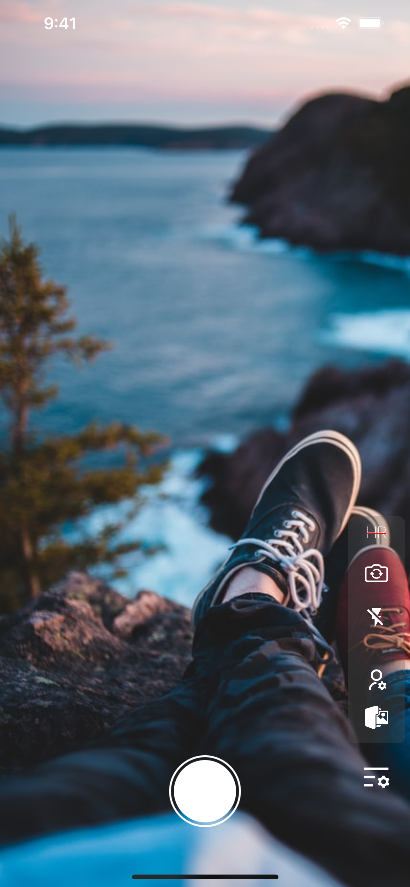
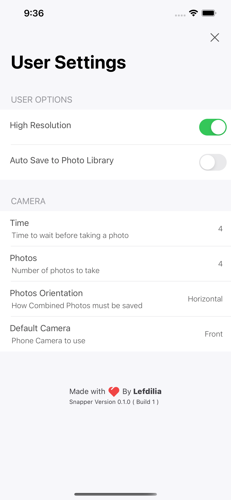
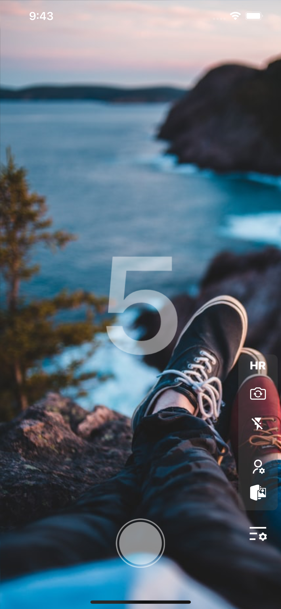

# Image Snapper
 

 
 

With Image Snapper you can enjoy your moments by taking and stitching images & Share them easily.

"Image Snapper" is an app that focus on stitching your token images and share them to social medias.

## Features
- Merge Images Vertical and Horizontal
- Set the timer to take a series of pictures
- Easy Share (Whatsapp, Instagram ...)
- Auto save to photo library

## App Store

## Screenshots

 
 
 
 

